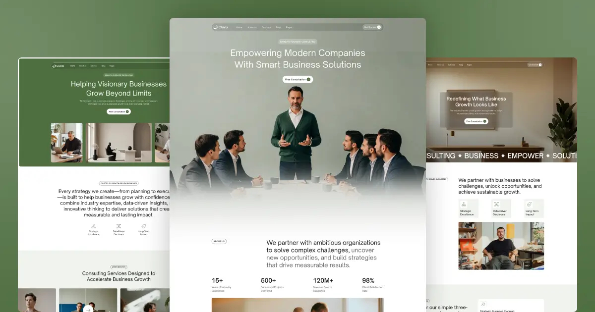

# Clavix: Business Consulting Astro Theme

Clavix is a premium Astro theme for consulting firms, agencies and corporate businesses. It ships with three home
pages, three about pages, three contact pages, services, team and blog sections, all powered by a headless CMS
(Strapi) with smooth, scroll-driven animations.

**Live demo:** https://clavix-astro.vercel.app



## Features

- Astro 7, fully static output (fast, SEO friendly, deploys anywhere)
- 17 page designs + dynamic detail pages for blog posts, services and team members
- Strapi v5 headless CMS with ready-made content types, a seed script and the Strapi MCP server enabled
- Works without a CMS too: falls back to the bundled demo content in `src/data/`
- GSAP animations (scroll reveals, split-text headings, marquees, sticky scroll sections) and Lenis smooth scrolling
- Accessible navigation, dropdown, sliders, video lightbox and contact forms in lightweight vanilla TypeScript (no jQuery)
- SEO component (Open Graph, Twitter cards, canonical URLs) and an XML sitemap
- Responsive at every breakpoint; respects `prefers-reduced-motion`

## Tech stack

| Layer | Technology |
|---|---|
| Framework | [Astro](https://astro.build) 7 |
| CMS | [Strapi](https://strapi.io) 5 (optional) |
| Animation | [GSAP](https://gsap.com) 3 (ScrollTrigger, SplitText), [Lenis](https://lenis.darkroom.engineering) |
| Styling | Plain CSS (design tokens as CSS custom properties) |
| Content rendering | [marked](https://marked.js.org) for CMS rich text (Markdown) |

## Getting started

Requirements: Node.js 22.12 or newer.

```bash
git clone https://github.com/Strockise/Atraen-Astro-Theme.git clavix
cd clavix
npm install
cp .env.example .env
npm run dev
```

Open http://localhost:4321. Without any further setup the site uses the demo content in `src/data/`.

### Connect Strapi (optional)

The Strapi project lives in [`strapi/`](strapi/) and has its own dependencies.

```bash
cd strapi
npm install
cp .env.example .env     # then generate your own secrets (see strapi/README.md)
npm run seed             # imports the demo blogs, services, team members and images
npm run develop          # admin panel at http://localhost:1337/admin
```

Then, in the theme's `.env`:

```bash
STRAPI_URL=http://localhost:1337
STRAPI_API_TOKEN=        # optional: a Read-only API token from Strapi > Settings > API Tokens
```

Restart `npm run dev` and the pages now read from Strapi. The site is generated statically, so after you
publish content changes you rebuild the site (in production, add a Strapi webhook that calls your host's deploy hook).

### Build

```bash
npm run build     # outputs to dist/
npm run preview   # serves the production build locally
```

## Configuration

| What | Where |
|---|---|
| Site name, URL, email, phone, address, social links, footer credit | `src/config/site.ts` |
| Header menu, Pages dropdown, footer links | `src/config/navigation.ts` |
| Contact form endpoint | `PUBLIC_FORM_ENDPOINT` in `.env` (Formspree, Web3Forms, Basin, ...) |
| Colors, typography, spacing (design tokens) | CSS custom properties at the top of `src/styles/clavix.webflow.css` |
| Your own CSS | `src/styles/custom.css` |
| Demo content (no-CMS mode) | `src/data/*.json`, images in `public/cms/` |

See [THEME-CUSTOMIZATION.md](THEME-CUSTOMIZATION.md) for the full guide.

## Project structure

```
├── public/              # fonts, images, videos, favicons
├── src/
│   ├── components/
│   │   ├── global/      # Header, Footer, SEO
│   │   ├── ui/          # PrimaryButton, SectionTitle
│   │   ├── cards/       # CMS item cards (blog, service, team)
│   │   └── sections/    # page sections, grouped by page ("shared" = used on several pages)
│   ├── config/          # site.ts, navigation.ts  ← start here
│   ├── data/            # demo content used when Strapi is not configured
│   ├── layouts/         # BaseLayout.astro
│   ├── lib/             # cms.ts (Strapi client + fallback), types.ts
│   ├── pages/           # routes (incl. blogs/[slug], services/[slug], team/[slug])
│   ├── scripts/         # interactions.ts (GSAP), webflow-ui.ts (nav, sliders, forms), main.ts
│   └── styles/          # base CSS + custom.css
└── strapi/              # Strapi v5 project: content types, seed data, MCP server config
```

## Pages

`/` · `/home/home-v2` · `/home/home-v3` · `/about-us/about-v1` · `/about-us/about-v2` · `/about-us/about-v3` ·
`/services` · `/services/[slug]` · `/blog` · `/blogs/[slug]` · `/team` · `/team/[slug]` ·
`/contact/contact-v1` · `/contact/contact-v2` · `/contact/contact-v3` · `/style-guide` · `/404`

## Credits

- Design: [strockise](https://www.strockise.com/)
- Fonts: [Inter](https://rsms.me/inter/) (SIL Open Font License), Open Sauce One (SIL Open Font License)
- Photos and videos: royalty-free stock (Pexels / generated imagery). Replace them with your own before going live.

## License

Code: [MIT](LICENSE). The demo photos and videos are royalty-free stock; check their terms before reusing them in your own project.
